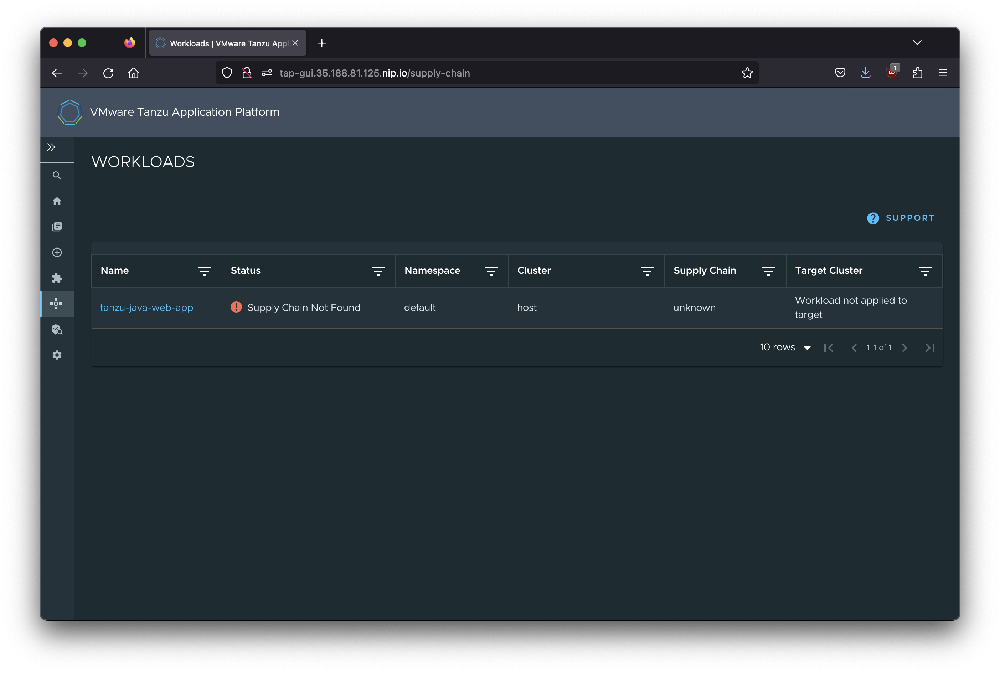

# Missing "has-tests" label

The cluster has a `source-test-to-url` supply chain but we don't have the corresponding `has-tests` label for our workload.

## Command to try

```sh
tanzu apps workload create tanzu-java-web-app \
  --git-repo https://github.com/trisberg/tanzu-java-web-app \
  --git-branch main \
  --type web \
  --label app.kubernetes.io/part-of=tanzu-java-web-app \
  --label apps.tanzu.vmware.com/auto-configure-actuators=true \
  --annotation autoscaling.knative.dev/min-scale=1 \
  --build-env "BP_JVM_VERSION=17"
```

## Result

### Tanzu CLI

```sh
% tanzu apps workload get tanzu-java-web-app
```
```text
📡 Overview
   name:        tanzu-java-web-app
   type:        web
   namespace:   default

💾 Source
   type:     git
   url:      https://github.com/trisberg/tanzu-java-web-app
   branch:   main

📦 Supply Chain
   name:   <none>

   Supply Chain resources not found.

🚚 Delivery

   Delivery resources not found.

💬 Messages
   Workload [SupplyChainNotFound]:   no supply chain found where full selector is satisfied by labels: map[app.kubernetes.io/part-of:tanzu-java-web-app apps.tanzu.vmware.com/auto-configure-actuators:true apps.tanzu.vmware.com/workload-type:web]

No pods found for workload.

To see logs: "tanzu apps workload tail tanzu-java-web-app --timestamp --since 1h"
```

### TAP-GUI



## Analysis

Query cluster for available supply chains and determine how to match them

```sh
kubectl get clustersupplychain -o jsonpath='{range .items[*]}{@.metadata.name}{" "}{@.spec.selector}{" "}{@.spec.selectorMatchExpressions}{" "}{@.spec.selectorMatchFields}{"\n"}{end}'
```
```text
source-test-to-url {"apps.tanzu.vmware.com/has-tests":"true"} [{"key":"apps.tanzu.vmware.com/workload-type","operator":"In","values":["web","server","worker"]}] 
testing-image-to-url  [{"key":"apps.tanzu.vmware.com/workload-type","operator":"In","values":["web","server","worker"]}] [{"key":"spec.image","operator":"Exists"}]
```

Looks like `source-test-to-url` requires `{"apps.tanzu.vmware.com/has-tests":"true"}` and `{"key":"apps.tanzu.vmware.com/workload-type","operator":"In","values":["web","server","worker"]}`

## Solution

Add this to the command:

```sh
...
  --label apps.tanzu.vmware.com/has-tests=true \
...
```

## Ask

Could we show a list of available supply chains and the matching selectors?
