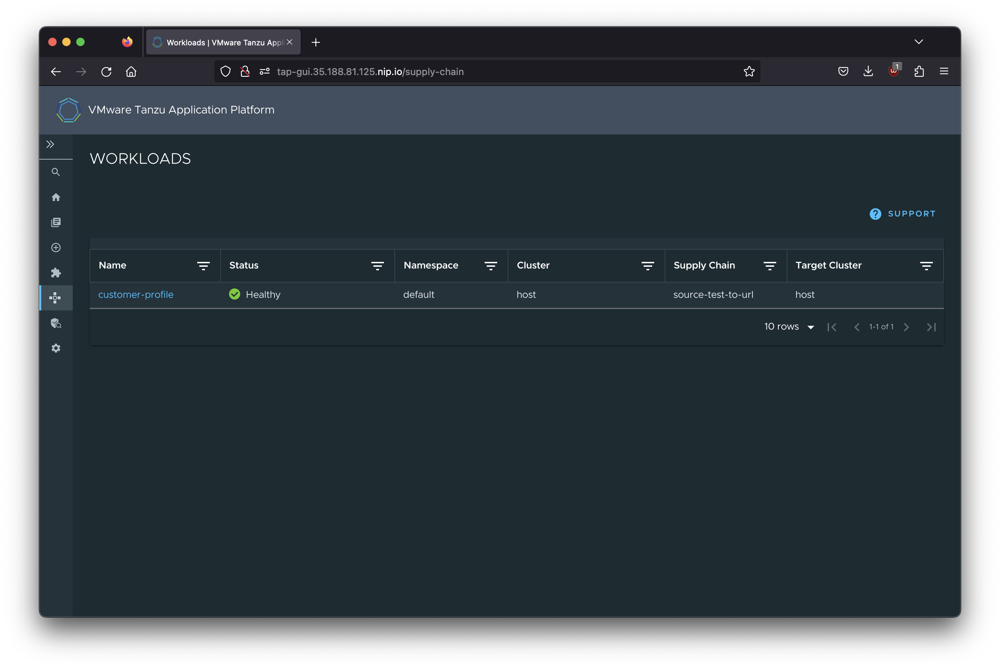
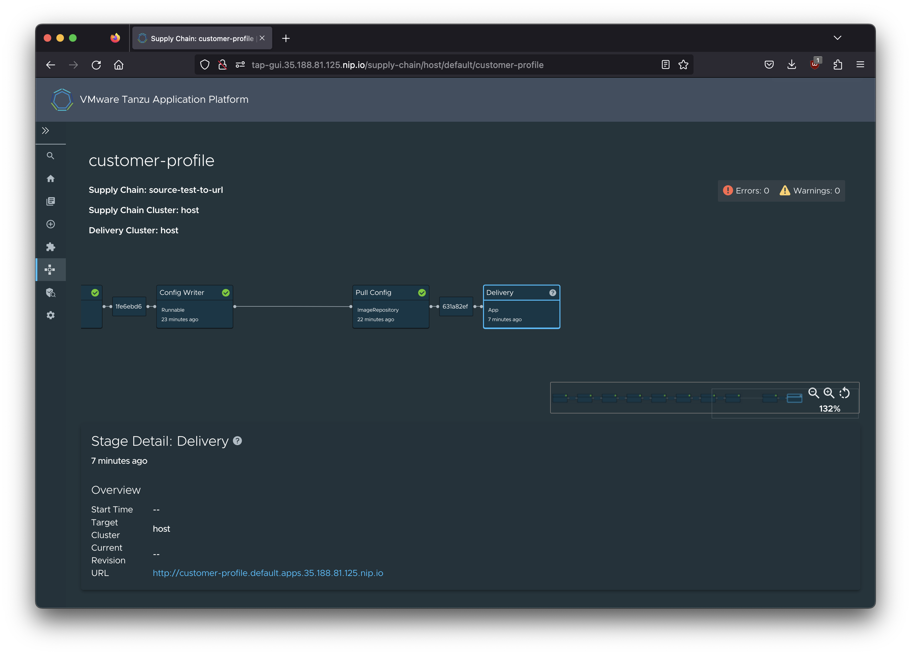

# Missing service claim

Deploying an app that uses a service binding but forgetting to create the service claim.

## Command to try

```
tanzu apps workload create customer-profile \
  --git-repo https://github.com/trisberg/java-rest-service \
  --git-branch main \
  --type web \
  --label app.kubernetes.io/part-of=customer-profile \
  --label apps.tanzu.vmware.com/auto-configure-actuators=true \
  --label apps.tanzu.vmware.com/has-tests=true \
  --annotation autoscaling.knative.dev/min-scale=1 \
  --build-env "BP_JVM_VERSION=17" \
  --service-ref "database=services.apps.tanzu.vmware.com/v1alpha1:ClassClaim:customer-database"
```

## Result

### Tanzu CLI

```
% tanzu apps workload get customer-profile                                             
📡 Overview
   name:        customer-profile
   type:        web
   namespace:   default

💾 Source
   type:     git
   url:      https://github.com/trisberg/java-rest-service
   branch:   main

📦 Supply Chain
   name:   source-test-to-url

   NAME               READY   HEALTHY   UPDATED   RESOURCE
   source-provider    True    True      5m6s      gitrepositories.source.toolkit.fluxcd.io/customer-profile
   source-tester      True    True      4m7s      runnables.carto.run/customer-profile
   image-provider     True    True      2m53s     images.kpack.io/customer-profile
   config-provider    True    True      2m45s     podintents.conventions.carto.run/customer-profile
   app-config         True    True      2m45s     configmaps/customer-profile
   service-bindings   True    True      2m45s     configmaps/customer-profile-with-claims
   api-descriptors    True    True      2m44s     configmaps/customer-profile-with-api-descriptors
   config-writer      True    True      2m36s     runnables.carto.run/customer-profile-config-writer

🚚 Delivery
   name:   delivery-basic

   NAME              READY     HEALTHY   UPDATED   RESOURCE
   source-provider   True      True      2m5s      imagerepositories.source.apps.tanzu.vmware.com/customer-profile-delivery
   deployer          Unknown   Unknown   2m1s      apps.kappctrl.k14s.io/customer-profile

💬 Messages
   Deliverable [ConditionNotMet]:   resource [deployer] condition not met: failed to evaluate succeededCondition.Key [.status.conditions[?(@.type=="ReconcileSucceeded")].status]: jsonpath returned empty list: .status.conditions[?(@.type=="ReconcileSucceeded")].status

🔁 Services
   CLAIM      NAME                KIND         API VERSION
   database   customer-database   ClassClaim   services.apps.tanzu.vmware.com/v1alpha1

🛶 Pods
   NAME                                       READY   STATUS      RESTARTS   AGE
   customer-profile-build-1-build-pod         0/1     Completed   0          4m7s
   customer-profile-config-writer-lsnqd-pod   0/1     Completed   0          2m46s
   customer-profile-w8bn4-test-pod            0/1     Completed   0          5m3s

To see logs: "tanzu apps workload tail customer-profile --timestamp --since 1h"
```

It stays like this until the App resource times out after 15 min and then we see:

```
% tanzu apps workload get customer-profile
📡 Overview
   name:        customer-profile
   type:        web
   namespace:   default

💾 Source
   type:     git
   url:      https://github.com/trisberg/java-rest-service
   branch:   main

📦 Supply Chain
   name:   source-test-to-url

   NAME               READY   HEALTHY   UPDATED   RESOURCE
   source-provider    True    True      18m       gitrepositories.source.toolkit.fluxcd.io/customer-profile
   source-tester      True    True      17m       runnables.carto.run/customer-profile
   image-provider     True    True      16m       images.kpack.io/customer-profile
   config-provider    True    True      16m       podintents.conventions.carto.run/customer-profile
   app-config         True    True      16m       configmaps/customer-profile
   service-bindings   True    True      16m       configmaps/customer-profile-with-claims
   api-descriptors    True    True      16m       configmaps/customer-profile-with-api-descriptors
   config-writer      True    True      16m       runnables.carto.run/customer-profile-config-writer

🚚 Delivery
   name:   delivery-basic

   NAME              READY     HEALTHY   UPDATED   RESOURCE
   source-provider   True      True      15m       imagerepositories.source.apps.tanzu.vmware.com/customer-profile-delivery
   deployer          Unknown   Unknown   23s       apps.kappctrl.k14s.io/customer-profile

💬 Messages
   Deliverable [ConditionNotMet]:   resource [deployer] condition not met: failed to evaluate succeededCondition.Key [.status.conditions[?(@.type=="ReconcileSucceeded")].status]: jsonpath returned empty list: .status.conditions[?(@.type=="ReconcileSucceeded")].status

🔁 Services
   CLAIM      NAME                KIND         API VERSION
   database   customer-database   ClassClaim   services.apps.tanzu.vmware.com/v1alpha1

🛶 Pods
   NAME                                                 READY   STATUS             RESTARTS      AGE
   customer-profile-00001-deployment-68db7644b4-x4kpd   0/2     CrashLoopBackOff   1 (17s ago)   29s
   customer-profile-build-1-build-pod                   0/1     Completed          0             17m
   customer-profile-config-writer-lsnqd-pod             0/1     Completed          0             16m
   customer-profile-w8bn4-test-pod                      0/1     Completed          0             18m

🚢 Knative Services
   NAME               READY     URL
   customer-profile   Unknown   http://customer-profile.default.apps.35.188.81.125.nip.io

To see logs: "tanzu apps workload tail customer-profile --timestamp --since 1h"
```

where there is a `CrashLoopBackOff` status on the deployed app.

### TAP-GUI





## Analysis

While waiting for the deployer App to time out, we can get the status from the `App` resource

```
% kubectl get apps.kappctrl.k14s.io/customer-profile -ojsonpath='{.status.deploy}' | jq
{
  "exitCode": 0,
  "finished": false,
  "startedAt": "2023-05-03T22:03:45Z",
  "stdout": "Target cluster 'https://10.112.0.1:443'\nChanges\nNamespace  Name                       Kind            Age  Op      Op st.  Wait to    Rs  Ri\ndefault    customer-profile           Service         -    create  -       reconcile  -   -\n^          customer-profile-database  ServiceBinding  -    create  -       reconcile  -   -\nOp:      2 create, 0 delete, 0 update, 0 noop, 0 exists\nWait to: 2 reconcile, 0 delete, 0 noop\nPod watching error: pods is forbidden: User cannot list resource \"pods\" in API group \"\" in the namespace(s) \"default\"\n10:03:45PM: ---- applying 1 changes [0/2 done] ----\n10:03:45PM: create servicebinding/customer-profile-database (servicebinding.io/v1alpha3) namespace: default\n10:03:45PM: ---- waiting on 1 changes [0/2 done] ----\n10:03:45PM: ongoing: reconcile servicebinding/customer-profile-database (servicebinding.io/v1alpha3) namespace: default\n10:03:45PM:  ^ No failing or successful conditions found\n10:04:45PM: ---- waiting on 1 changes [0/2 done] ----\n10:04:45PM: ongoing: reconcile servicebinding/customer-profile-database (servicebinding.io/v1alpha3) namespace: default\n10:04:45PM:  ^ No failing or successful conditions found\n10:05:45PM: ---- waiting on 1 changes [0/2 done] ----\n10:05:45PM: ongoing: reconcile servicebinding/customer-profile-database (servicebinding.io/v1alpha3) namespace: default\n10:05:45PM:  ^ No failing or successful conditions found\n10:06:46PM: ---- waiting on 1 changes [0/2 done] ----\n10:06:46PM: ongoing: reconcile servicebinding/customer-profile-database (servicebinding.io/v1alpha3) namespace: default\n10:06:46PM:  ^ No failing or successful conditions found",
  "updatedAt": "2023-05-03T22:07:43Z"
}
```

and there we can see 

```
---- waiting on 1 changes [0/2 done] ----
10:06:46PM: ongoing: reconcile servicebinding/customer-profile-database (servicebinding.io/v1alpha3) namespace: default
```

which could tip us off that there is something up with the service binding.

After the deployer App times out we can get the logs for the deployment pod

```
% kubectl logs customer-profile-00001-deployment-68db7644b4-x4kpd
Defaulted container "workload" out of: workload, queue-proxy
Setting Active Processor Count to 4
Calculating JVM memory based on 14585656K available memory
For more information on this calculation, see https://paketo.io/docs/reference/java-reference/#memory-calculator
Calculated JVM Memory Configuration: -XX:MaxDirectMemorySize=10M -Xmx14168149K -XX:MaxMetaspaceSize=110306K -XX:ReservedCodeCacheSize=240M -Xss1M (Total Memory: 14585656K, Thread Count: 50, Loaded Class Count: 17061, Headroom: 0%)
Enabling Java Native Memory Tracking
Adding 124 container CA certificates to JVM truststore
Spring Cloud Bindings Enabled
Picked up JAVA_TOOL_OPTIONS: -Dmanagement.endpoint.health.probes.add-additional-paths="true" -Dmanagement.endpoint.health.show-details="always" -Dmanagement.endpoints.web.base-path="/actuator" -Dmanagement.endpoints.web.exposure.include="*" -Dmanagement.health.probes.enabled="true" -Dmanagement.server.port="8081" -Dserver.port="8080" -Dserver.shutdown.grace-period="24s" -Djava.security.properties=/layers/paketo-buildpacks_bellsoft-liberica/java-security-properties/java-security.properties -XX:+ExitOnOutOfMemoryError -XX:ActiveProcessorCount=4 -XX:MaxDirectMemorySize=10M -Xmx14168149K -XX:MaxMetaspaceSize=110306K -XX:ReservedCodeCacheSize=240M -Xss1M -XX:+UnlockDiagnosticVMOptions -XX:NativeMemoryTracking=summary -XX:+PrintNMTStatistics -Dorg.springframework.cloud.bindings.boot.enable=true

  .   ____          _            __ _ _
 /\\ / ___'_ __ _ _(_)_ __  __ _ \ \ \ \
( ( )\___ | '_ | '_| | '_ \/ _` | \ \ \ \
 \\/  ___)| |_)| | | | | || (_| |  ) ) ) )
  '  |____| .__|_| |_|_| |_\__, | / / / /
 =========|_|==============|___/=/_/_/_/
 :: Spring Boot ::                (v3.0.5)

2023-05-03T22:20:40.647Z  INFO 1 --- [           main] c.example.customerprofile.Application    : Starting Application v0.0.1-SNAPSHOT using Java 17.0.6 with PID 1 (/workspace/BOOT-INF/classes started by cnb in /workspace)
2023-05-03T22:20:40.660Z  INFO 1 --- [           main] c.example.customerprofile.Application    : No active profile set, falling back to 1 default profile: "default"
2023-05-03T22:20:42.631Z  INFO 1 --- [           main] .s.d.r.c.RepositoryConfigurationDelegate : Bootstrapping Spring Data JPA repositories in DEFAULT mode.
2023-05-03T22:20:42.718Z  INFO 1 --- [           main] .s.d.r.c.RepositoryConfigurationDelegate : Finished Spring Data repository scanning in 72 ms. Found 1 JPA repository interfaces.
2023-05-03T22:20:43.673Z  INFO 1 --- [           main] o.s.b.w.embedded.tomcat.TomcatWebServer  : Tomcat initialized with port(s): 8080 (http)
2023-05-03T22:20:43.689Z  INFO 1 --- [           main] o.apache.catalina.core.StandardService   : Starting service [Tomcat]
2023-05-03T22:20:43.689Z  INFO 1 --- [           main] o.apache.catalina.core.StandardEngine    : Starting Servlet engine: [Apache Tomcat/10.1.7]
2023-05-03T22:20:43.853Z  INFO 1 --- [           main] o.a.c.c.C.[Tomcat].[localhost].[/]       : Initializing Spring embedded WebApplicationContext
2023-05-03T22:20:43.857Z  INFO 1 --- [           main] w.s.c.ServletWebServerApplicationContext : Root WebApplicationContext: initialization completed in 3097 ms
2023-05-03T22:20:44.188Z  WARN 1 --- [           main] ConfigServletWebServerApplicationContext : Exception encountered during context initialization - cancelling refresh attempt: org.springframework.beans.factory.BeanCreationException: Error creating bean with name 'flyway' defined in class path resource [org/springframework/boot/autoconfigure/flyway/FlywayAutoConfiguration$FlywayConfiguration.class]: Failed to instantiate [org.flywaydb.core.Flyway]: Factory method 'flyway' threw exception with message: Error creating bean with name 'dataSource' defined in class path resource [org/springframework/boot/autoconfigure/jdbc/DataSourceConfiguration$Hikari.class]: Failed to instantiate [com.zaxxer.hikari.HikariDataSource]: Factory method 'dataSource' threw exception with message: Failed to determine a suitable driver class
2023-05-03T22:20:44.196Z  INFO 1 --- [           main] o.apache.catalina.core.StandardService   : Stopping service [Tomcat]
2023-05-03T22:20:44.251Z  INFO 1 --- [           main] .s.b.a.l.ConditionEvaluationReportLogger : 

Error starting ApplicationContext. To display the condition evaluation report re-run your application with 'debug' enabled.
2023-05-03T22:20:44.286Z ERROR 1 --- [           main] o.s.b.d.LoggingFailureAnalysisReporter   : 

***************************
APPLICATION FAILED TO START
***************************

Description:

Failed to configure a DataSource: 'url' attribute is not specified and no embedded datasource could be configured.

Reason: Failed to determine a suitable driver class


Action:

Consider the following:
	If you want an embedded database (H2, HSQL or Derby), please put it on the classpath.
	If you have database settings to be loaded from a particular profile you may need to activate it (no profiles are currently active).
```

And the new deployer App still has some clue in the status:

```
% kubectl get apps.kappctrl.k14s.io/customer-profile -ojsonpath='{.status.deploy}' | jq
{
  "exitCode": 0,
  "finished": false,
  "startedAt": "2023-05-03T22:18:50Z",
  "stdout": "Target cluster 'https://10.112.0.1:443'\nChanges\nNamespace  Name                       Kind            Age  Op      Op st.  Wait to    Rs  Ri\ndefault    customer-profile           Service         -    create  -       reconcile  -   -\n^          customer-profile-database  ServiceBinding  15m  -       -       reconcile  ok  -\nOp:      1 create, 0 delete, 0 update, 1 noop, 0 exists\nWait to: 2 reconcile, 0 delete, 0 noop\nPod watching error: pods is forbidden: User cannot list resource \"pods\" in API group \"\" in the namespace(s) \"default\"\n10:18:50PM: ---- applying 2 changes [0/2 done] ----\n10:18:50PM: noop servicebinding/customer-profile-database (servicebinding.io/v1alpha3) namespace: default\nWarning: Kubernetes default value is insecure, Knative may default this to secure in a future release: spec.template.spec.containers[0].securityContext.allowPrivilegeEscalation, spec.template.spec.containers[0].securityContext.capabilities, spec.template.spec.containers[0].securityContext.runAsNonRoot, spec.template.spec.containers[0].securityContext.seccompProfile\n10:18:50PM: create service/customer-profile (serving.knative.dev/v1) namespace: default\n10:18:50PM: ---- waiting on 2 changes [0/2 done] ----\n10:18:50PM: ok: reconcile service/customer-profile (serving.knative.dev/v1) namespace: default\n10:18:50PM: ongoing: reconcile servicebinding/customer-profile-database (servicebinding.io/v1alpha3) namespace: default\n10:18:50PM:  ^ No failing or successful conditions found\n10:18:50PM: ---- waiting on 1 changes [1/2 done] ----\n10:19:51PM: ---- waiting on 1 changes [1/2 done] ----\n10:19:51PM: ongoing: reconcile servicebinding/customer-profile-database (servicebinding.io/v1alpha3) namespace: default\n10:19:51PM:  ^ No failing or successful conditions found\n10:20:51PM: ---- waiting on 1 changes [1/2 done] ----\n10:20:51PM: ongoing: reconcile servicebinding/customer-profile-database (servicebinding.io/v1alpha3) namespace: default\n10:20:51PM:  ^ No failing or successful conditions found\n10:21:51PM: ---- waiting on 1 changes [1/2 done] ----\n10:21:51PM: ongoing: reconcile servicebinding/customer-profile-database (servicebinding.io/v1alpha3) namespace: default\n10:21:51PM:  ^ No failing or successful conditions found",
  "updatedAt": "2023-05-03T22:22:34Z"
}
```

## Solution

Create a service claim for the database:

```
tanzu service class-claim create customer-database --class postgresql-unmanaged -n default
```

and hope that everything eventually reconciles and we have the app up and running.

```
% tanzu apps workload get customer-profile                                       
📡 Overview
   name:        customer-profile
   type:        web
   namespace:   default

💾 Source
   type:     git
   url:      https://github.com/trisberg/java-rest-service
   branch:   main

📦 Supply Chain
   name:   source-test-to-url

   NAME               READY   HEALTHY   UPDATED   RESOURCE
   source-provider    True    True      30m       gitrepositories.source.toolkit.fluxcd.io/customer-profile
   source-tester      True    True      29m       runnables.carto.run/customer-profile
   image-provider     True    True      28m       images.kpack.io/customer-profile
   config-provider    True    True      27m       podintents.conventions.carto.run/customer-profile
   app-config         True    True      27m       configmaps/customer-profile
   service-bindings   True    True      27m       configmaps/customer-profile-with-claims
   api-descriptors    True    True      27m       configmaps/customer-profile-with-api-descriptors
   config-writer      True    True      27m       runnables.carto.run/customer-profile-config-writer

🚚 Delivery
   name:   delivery-basic

   NAME              READY   HEALTHY   UPDATED   RESOURCE
   source-provider   True    True      27m       imagerepositories.source.apps.tanzu.vmware.com/customer-profile-delivery
   deployer          True    True      2m16s     apps.kappctrl.k14s.io/customer-profile

💬 Messages
   No messages found.

🔁 Services
   CLAIM      NAME                KIND         API VERSION
   database   customer-database   ClassClaim   services.apps.tanzu.vmware.com/v1alpha1

🛶 Pods
   NAME                                                 READY   STATUS        RESTARTS      AGE
   customer-profile-00001-deployment-68db7644b4-x4kpd   0/2     Terminating   7             12m
   customer-profile-00002-deployment-6fb7cc655b-rtczb   2/2     Running       4 (87s ago)   2m23s
   customer-profile-build-1-build-pod                   0/1     Completed     0             29m
   customer-profile-config-writer-lsnqd-pod             0/1     Completed     0             27m
   customer-profile-w8bn4-test-pod                      0/1     Completed     0             30m

🚢 Knative Services
   NAME               READY   URL
   customer-profile   Ready   http://customer-profile.default.apps.35.188.81.125.nip.io

To see logs: "tanzu apps workload tail customer-profile --timestamp --since 1h"
```

## Ask

Could we show the status of a service claim or highlight if it is missing.
Right now we only show that the workload is asking for a claim but not whether it exists or is healthy.
